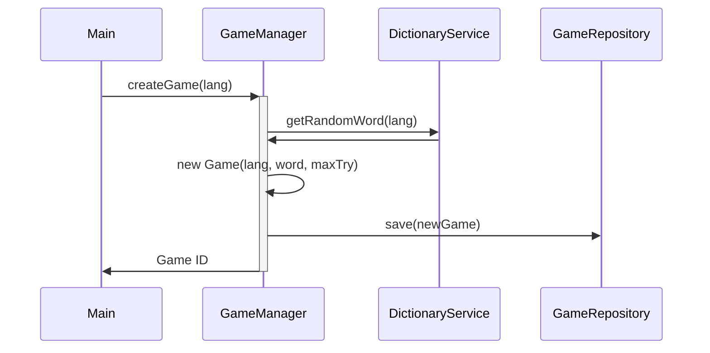
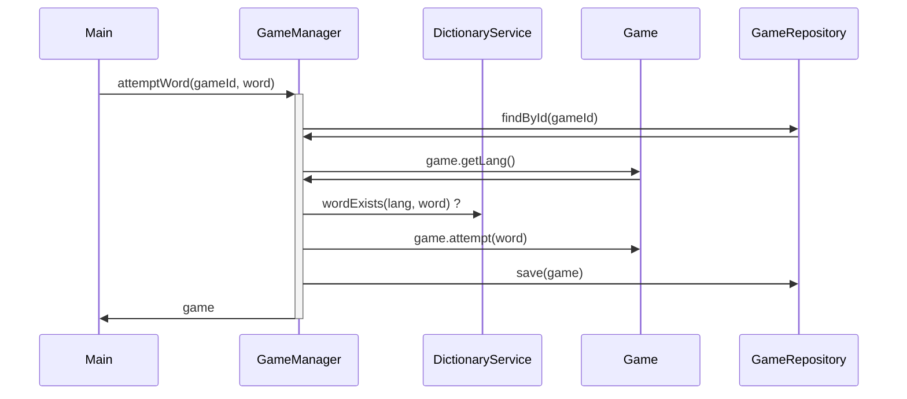
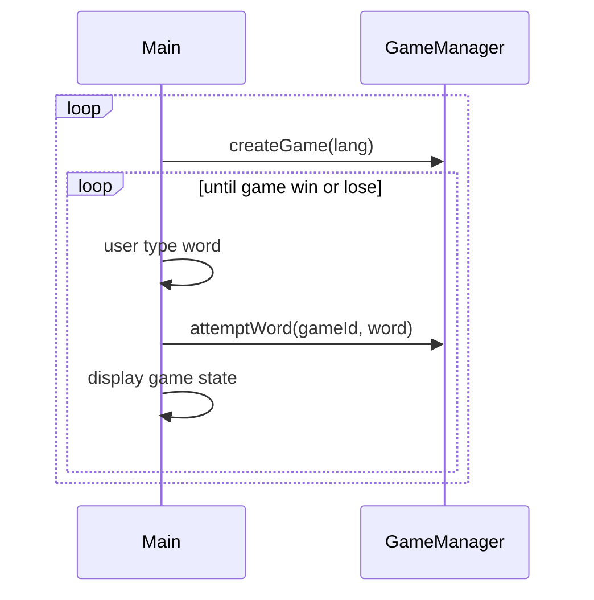
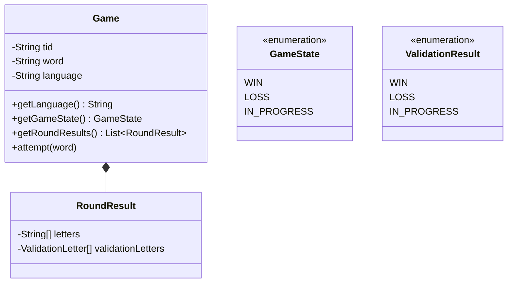

## Jouer une partie

### 1. Créer la partie

```mermaid
sequenceDiagram
    participant M as Main
    participant GM as GameManager
    participant DS as DictionaryService
    participant GR as GameRepository
    M->>+GM: createGame(lang)
    GM->>DS: getRandomWord(lang)
    DS->>GM: 
    GM->>GM: new Game(lang, word, maxTry)
    GM->>GR: save(newGame)
    GM->>-M: Game ID
```

### 2. Faire un essai

```mermaid
sequenceDiagram
    participant M as Main
    participant GM as GameManager
    participant DS as DictionaryService
    participant G as Game
    participant GR as GameRepository
    M->>+GM: attemptWord(gameId, word)
    GM->>GR: findById(gameId)
    GR->>GM: 
    GM->>G: game.getLang()
    G->>GM: 
    GM->>DS: wordExists(lang, word) ?
    GM->>G: game.attempt(word)
    GM->>GR: save(game)
    GM->>-M: game
```

### 3. Déroulement d'une partie

```mermaid
sequenceDiagram
    participant M as Main
    participant GM as GameManager
    loop
        M->>GM: createGame(lang)
        loop until game win or lose
            M->>M: user type word
            M->>GM: attemptWord(gameId, word)
            M->>M: display game state
        end
    end
```

### Modélisation

```mermaid
classDiagram
    Game *--RoundResult

    class Game {
        -String tid
        -String word
        -String language
        
        +getLanguage() String
        +getGameState() GameState
        +getRoundResults() List~RoundResult~
        +attempt(word)
    }
    
    class RoundResult {
        -String[] letters
        -ValidationLetter[] validationLetters
    }
    
    class GameState{
        <<enumeration>>
        WIN
        LOSS
        IN_PROGRESS
    }
    
    class ValidationResult{
        <<enumeration>>
        WIN
        LOSS
        IN_PROGRESS
    }
```